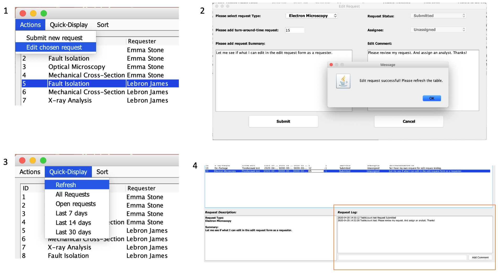

# Lab Request Tracker

## Project Inspiration

Lab management system to track request queue. This is inspired by two similar problems we face at our jobs.

Chao, the system manager of his lab is responsible for managing a request queue. The current system the lab is using basically Email + Excel. Chao has to collect requests from different requesters via email, and then manually enter data into the Excel queue. A lot of the work is repetitive and prone to errors. With the Excel system, it is difficult to track priorities, control edits, maintain approval process, etc. Chao thinks we should build a simple GUI task/queue management system to solve some of the challenges the lab is facing currently.

Alex, the systems and tools PM receives many tools related requests via email and slack and has to track the requests in an Excel sheet. Often times, the requests get changed or de-prioritized. Alex has to manually update the Excel sheet and communicate the status of requests to stakeholders/requesters via email. The entire process is very tedious and prone to errors. Alex thinks it would be helpful if we can build a simple tool that gives requesters and stakeholders access to submit, change, or view requests; and gives Alex ability to sort or search the requests.

## Features List

Create a GUI system by using Java and database to help manage the request queue, with the following features:

- Provide GUI support for users to submit requests by filling required fields, like requestor contact info, sample numbers and details, analysis type, turn-around time request, etc.
- The system will generate an entry into the GUI system, with specific request ID and time stamp. The initial status of the request will be “Under Review”.
- After request is submitted, the system manager can review the request and accept/reject the request.
- The GUI system can be accessed by manager and requestor for tracking. It provides different status and priority level for tracking the request progress, i.e., Under review, Sample received, Analysis in progress, Analyzed, Reported, etc.
- Allow updates and changes to each request.
- The GUI also provides sorting functionality so that you can sort requests based on certain criteria like requestor name, time stamp, status.
- User management with access control

## Technology Stack

- Backend: Java 8.0
- Frontend (UI): Java Swing
- Database: MySQL
- Version Control: GitHub

## High Level Architecture

## CRC Cards

## Database Design

## Database Implementation

If you are interested to learn more about how our database is constructed, please reach out to us. We’d be more than happy to show you the details.

## Steps to Run Our Code

This is still work in progress as we build our classes and methods. If you would like to run the current code to see the progress, please follow these steps:

- Download or clone this entire repository
- Save everything in your local machine
- Import everything into your IDE like Eclipse
- Run the LabRequestTrackerRunner class
- If you see an error telling you "unable to connect to database", please try the following:
  - the mysql-connector-java-8.0.19.jar file in the /bin folder needs to be added into classpath in order to run DatabaseDriver
  - go to the lib folder and double click on the mysql-connector-java-8.0.19.jar file. A window will popup, select the option for "Associate '\*.jar' files with current editor (System editor) and do not ask again"
- After you run the LabRequestTrackerRunner, a welcome window will pop up for you to log in. Below are the steps to try out different features implemented in this app.
- If you have an account already, simply enter your email and password (see screenshot below)
  - You will receive error messages if your input is invalid, or if your information doesn’t match with the data in the database
- If this is your first time trying out the app, you can click on “Register” to create a new account.
  - If your email is already registered, you will receive an error message (see screenshot below) to tell you that your email is already registered.
    
- Once you are logged in, you will be brought to the main page, where you can see all the requests submitted into the system. (see screenshot below)
- You will have different options to change the views based the following:
  - Click on “Quick Display” on top left navigation bar, where you can choose to show only Open Requests, requested submitted within the last 7 days, 14 days, or 30 days.
  - Click on “Sort” right next to “Quick Display”, you will have different sorting options available for you to sort the requests table.
    
- Go to “Actions” on the top left navigation bar.
- Click on “Submit new request” (see image #1 in screenshot below)
- A “submit new request” window will pop up for you to enter the required information.
  - Select the request type from the pre-defined list of types (see image #2 in screenshot below)
  - Enter turn-around-time to indicate in how many days do you expect this request to be completed
  - Enter a brief summary to describe the request
  - Hit “Submit”, you will receive a note informing you that your request has been successfully submitted with your request ID for your reference (see image #3 in screenshot below)
  - It will take you back to the main page, make sure to go to “Quick-display” and click on “All Requests” in order to see your newly submitted tickets on the list (see image #4 in screenshot below)
    
- You can edit request by following the next few steps:
  - Select a request that’s submitted by you.
    - If you select a request that’s submitted by someone else, you will be notified that “you can only edit your own requests”. (see screenshot)
    - We have three different user roles defined in the system: manager, analyst, and requester. Managers and Analysts are entered in the database. All the new users created directly from the User Registration page will be requesters.
    - Managers and Analysts have certain permissions to edit everyone’s requests (will explain more towards the end of this doc)
      
  - go to “Actions” button on top left navigation bar, click on “Edit chosen request” (see #1 on screenshot)
  - A separate window will pop up for you to make changes to your selected request
  - Make changes to your request and hit “Submit”, you should receive a notice informing you that “Edit request successful” (see #2 on the screenshot)
  - Click on ”OK” will bring you back to the main page, from where you’ll need to go to “Quick Display” to hit “Refresh” (see #3 on the screenshot)
  - You can also add comments directly on the main page for your selected request (see #4 on the screenshot)
    
- As described above, managers and analysts have different permissions than requesters. They can edit additional fields like “Request Status” and “Assignee”
  

## JUnit Tests and Javadocs

- If you need to run the unit tests, make sure that you have added JUnit 5 library to the build path. We decided to have two separate unit test files because the database host we are currently using is a free one and it only allows a certain number of connection calls at the same time, separating the unit tests would reduce the number of connection calls and ensure the tests run without getting connection errors. Make sure to check out both UnitTestPartOne.java and UnitTestPartTwo.java files.
- You can also refer to the doc folder for detailed Javadoc.

Thanks for trying out the Lab Request Tracker!
